# Контрольная работа
***
## Задание
1. Используя команду cat в терминале операционной системы Linux, создать
   два файла Домашние животные (заполнив файл собаками, кошками,
   хомяками) и Вьючные животными заполнив файл Лошадьми, верблюдами и
   ослы), а затем объединить их. Просмотреть содержимое созданного файла.
   Переименовать файл, дав ему новое имя (Друзья человека).

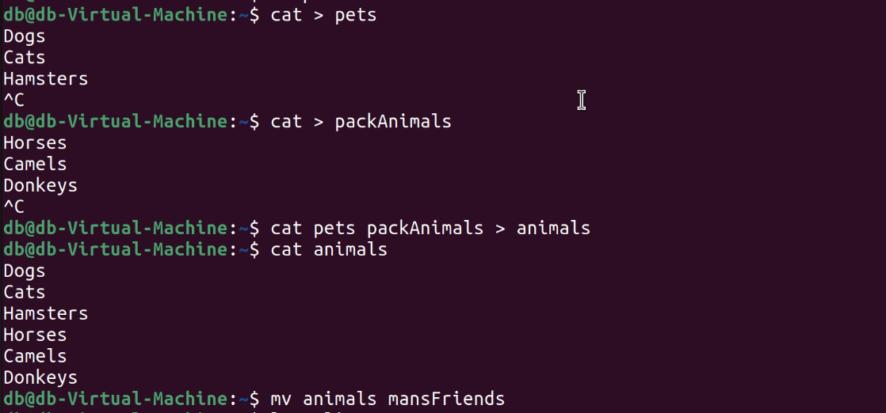
***
2. Создать директорию, переместить файл туда.

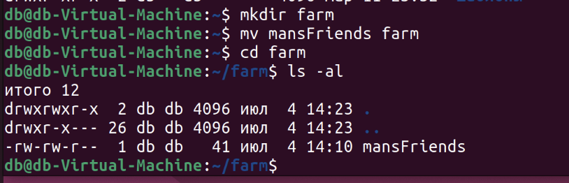
***
3. Подключить дополнительный репозиторий MySQL. Установить любой пакет
   из этого репозитория.

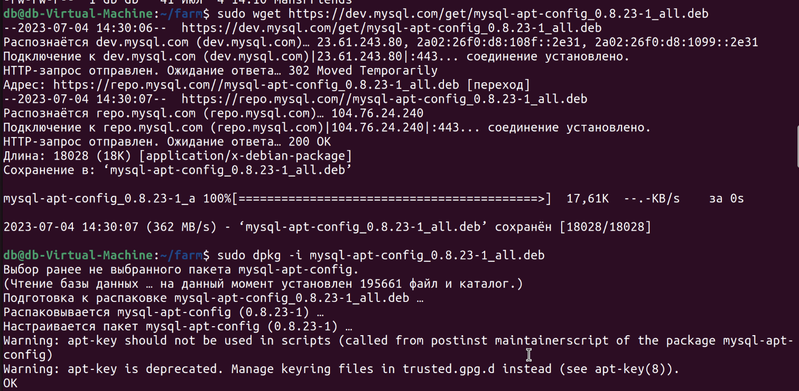
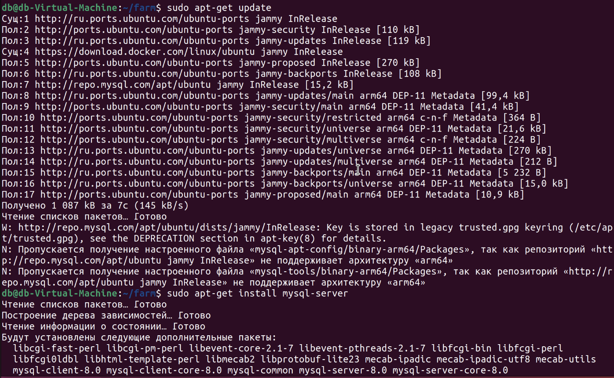
***
4. Установить и удалить deb-пакет с помощью dpkg.

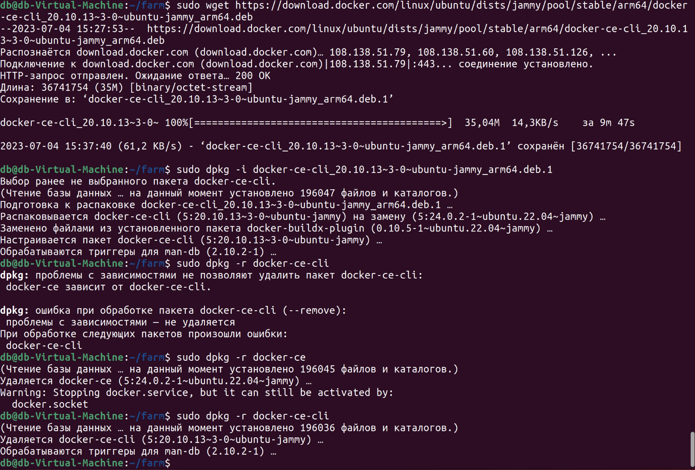
***
5. Выложить историю команд в терминале ubuntu

* cat > pets
* cat > packAnimals
* cat pets packAnimals > animals
* cat animals
* mv animals mansFriends

–––

* mkdir farm 
* mv mansFriends farm 
* cd farm 
* ls -al

–––

* sudo wet https://dev.mysql.com/get/mysql-apt-config_0.8.23-1_all.deb
* sudo dpkg -i mysql-apt-config_0.8.23-1_all.deb
* sudo apt-get update
* sudo apt-get install mysql-server

–––

* sudo wet https://download.docker.com/linux/ubuntu/dists/jammy/pool/stable/arm64/docker-ce-cli_20.10.13~3-0~ubuntu-jammy_arm64.deb
* sudo dpkg -i docker-ce-cli_20.10.13~3-0~ubuntu-jammy_arm64.deb.1
* sudo dpkg -r sudo dpkg -r docker-ce
* sudo dpkg -r docker-ce-cli
***
6.  Нарисовать диаграмму, в которой есть класс родительский класс, домашние
    животные и вьючные животные, в составы которых в случае домашних
    животных войдут классы: собаки, кошки, хомяки, а в класс вьючные животные
    войдут: Лошади, верблюды и ослы).

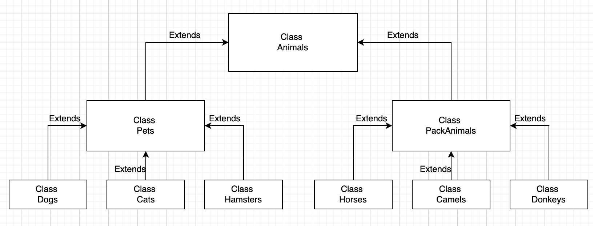
[Ссылка на диаграмму с классами](Classes.drawio)
***
7. В подключенном MySQL репозитории создать базу данных “Друзья
   человека”

CREATE DATABASE MansFriends;
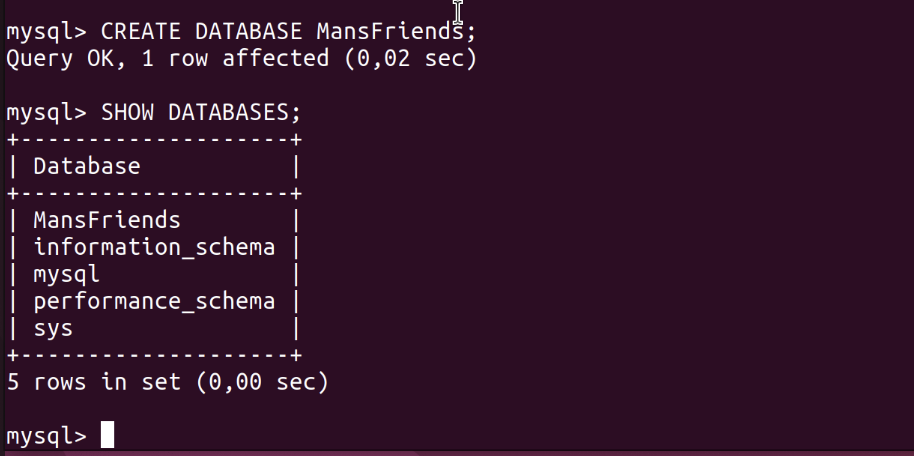
***
8. Создать таблицы с иерархией из диаграммы в БД

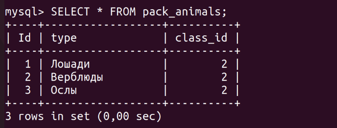

[Реализация задания №8](Animals.sql)
***
9. Заполнить низкоуровневые таблицы именами(животных), командами
которые они выполняют и датами рождения

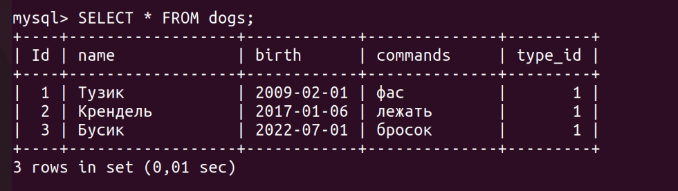

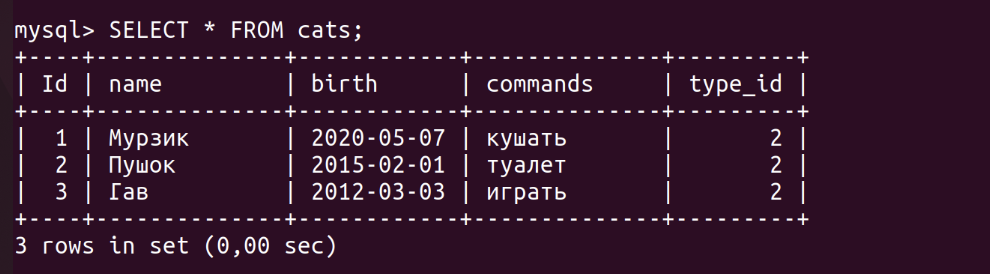

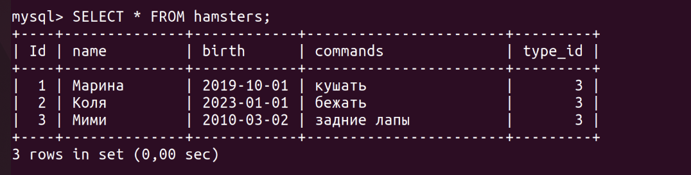

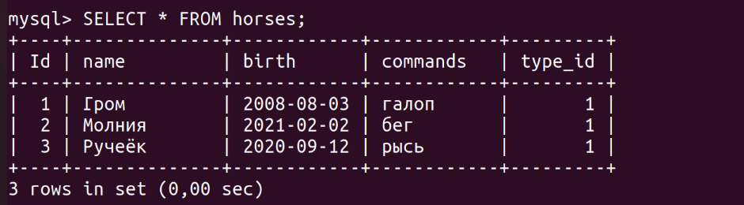

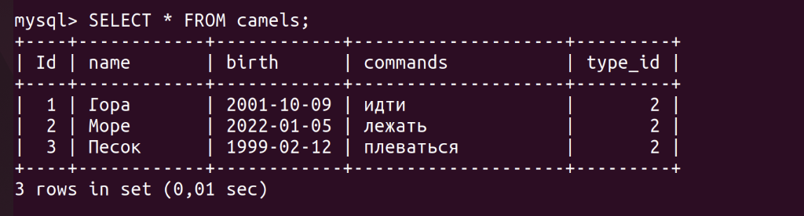

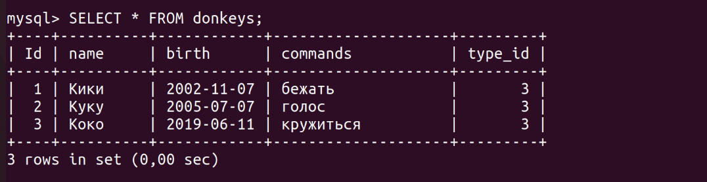

[Реализация задания №9](Animals.sql)

